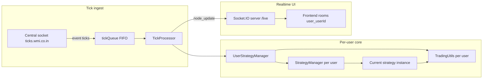

# Strategy HQ — System workflow

This document describes how the **Strategy HQ** Node.js service ingests market ticks, isolates state per user, loads trading strategies from disk, and pushes updates to connected frontends. Per-strategy behavior is covered in separate files under `docs/`.

## High-level architecture

## Runtime entry point (`server.js`)

1. **HTTP + Socket.IO** — Express serves static assets (`public/`). A Socket.IO server attaches to the same HTTP server with namespace **`/live`** (CORS and transports are configured for browser clients).

2. **MongoDB** — `connectDB()` runs at startup (credentials via environment).

3. **UserStrategyManager** — A single global instance maps each `userId` to:
   - its own **`StrategyManager`** (`controllers/strategyController.js`);
   - its own **`TradingUtils`** (Kite Connect–style API wrapper);
   - an optional per-user log file path under `logs/`.

4. **TickProcessor** — Constructed with a concurrency limit (default **10**). It queues per-user work when the limit is exceeded and records timing/error stats.

5. **Central tick feed** — A **socket.io-client** connects to `https://ticks.wmi.co.in`. On event **`ticks`**, payloads are pushed to **`tickQueue`**, and **`processTickQueue()`** drains the queue serially (one batch at a time through the async loop).

## Tick processing pipeline

For each batch from the central server:

1. **`processTick`** (`server.js`) loads **`activeUsers`** from `UserStrategyManager.getActiveUsers()`.

2. **`tickProcessor.processMultipleUsers`**:
   - builds an **immutable snapshot** of the tick array (clone of `instrument_token`, `symbol`, `last_price`) so all users see the same prices for that batch;
   - for each active user, schedules **`processTicksForUser(userId, snapshot)`** with bounded concurrency.

3. **`UserStrategyManager.processTicksForUser`**:
   - resolves that user’s `StrategyManager` and `TradingUtils`;
   - **re-injects** `tradingUtils` and Socket.IO on `currentStrategy` if missing (defensive fix for stale references);
   - calls **`strategyManager.processTicks(ticks)`**, which delegates to **`currentStrategy.processTicks(ticks)`**.

4. On success, the tick processor emits **`node_update`** to room **`user_${userId}`** on namespace **`/live`**, with the object returned from processing (tick batch, dictionary snapshots, current strategy config, selected instrument, etc.).

## Strategy loading and selection

**`StrategyManager`** (`controllers/strategyController.js`) at construction:

- Reads every `*.js` file in **`strategies/`** except **`base.js`**.
- **`require()`** each file, instantiates the exported class once, and registers it in a **`Map`** keyed by **`strategy.name`**.

When a user selects a strategy (Socket event **`select_strategy`**):

1. **`UserStrategyManager.setStrategyForUser`** calls **`strategyManager.setStrategy(strategyName, globalDict, universalDict, blockDict)`**.
2. The chosen strategy’s **`initialize(globalDict, universalDict, blockDict, accessToken)`** runs; dictionaries are **shared references** held on the manager and strategy.
3. **`TradingUtils`** and **`setSocketIo(ioServer, userId, userName)`** are injected on the live strategy instance so orders and realtime emits work.

**Available strategies** are exposed to the client as **`getConfig()`**-style metadata from each loaded instance (name, description, parameter schemas).

## Configuration model: three dictionaries

All concrete strategies extend **`BaseStrategy`** (`strategies/base.js`) and share:

| Dictionary      | Typical use |
|-----------------|-------------|
| **`globalDict`** | User credentials (`api_key`, `secret_key`, `access_token`), strategy “global” knobs (targets, stoploss, toggles). Often includes **`timestamp`** updated per tick in some strategies. |
| **`universalDict`** | Per-strategy universe: instrument maps, CE/PE token lists, cycle counters, feature flags (`enableTrading`, `usePrebuy`, etc.). |
| **`blockDict`** | Optional block-scratch data (e.g. **`lastPrices`** in MTM). |

Updates from the UI:

- Socket **`update_global_dict_parameter`** → **`updateGlobalDictParameter`** on the active strategy.
- Socket **`update_universal_dict_parameter`** → **`updateUniversalDictParameter`**.

Successful updates may trigger **`emitParameterUpdate`** / **`emitStatusUpdate`** on **`/live`** to **`user_${userId}`**.

## Realtime channel conventions

- Clients connect to **`/live`** and authenticate with **`authenticate_user`** (credentials + `userId` / `userName`).
- Server **`socket.join(\`user_${userId}\`)`** so **`io.of('/live').to(\`user_${userId}\`).emit(...)`** reaches the right dashboards.
- **`BaseStrategy.emitToUser`** targets the same room and namespace; strategies emit events such as **`strategy_parameter_updated`**, **`strategy_status_update`**, **`strategy_trade_action`**, plus strategy-specific updates where implemented.

## Supporting utilities

- **`utils/strategyUtils.js`** — Shared helpers (token range filtering, CE/PE separation, sequential filter flow for MTM-style logic, logging helpers).
- **`utils/tradingUtils.js`** — Order placement, order history, logging; requires prior **`initializeKiteConnect`** from user credentials.
- **`collection-framework/TradeQueue.js`** — Simple FIFO queue used by MTM strategies for staged trade actions.

## Related documentation

| Document | Scope |
|----------|--------|
| [strategy-mtm-v5-shared-v3.md](./strategy-mtm-v5-shared-v3.md) | MTM V5 Shared V3 + V3 Anti |
| [strategy-strategy-x.md](./strategy-strategy-x.md) | Strategy X |
| [strategy-fpfs-v4.md](./strategy-fpfs-v4.md) | Fifty Percent Full Spectrum V4 (CE + PE) |
| [strategy-fpfs-v4-pe.md](./strategy-fpfs-v4-pe.md) | FPFS V4 PE-only tracking |
| [strategy-fpfs-v4-ce.md](./strategy-fpfs-v4-ce.md) | FPFS V4 CE-only tracking |

## Operational notes

- **No active users** — Tick batches are accepted but **`processTick`** exits early if there is no authenticated/active user list.
- **Paper vs live** — Strategies generally gate real orders on **`enableTrading`** (or equivalent) in their dictionaries; when false, many paths log “paper” behavior only.
- **Legacy / analysis** — The folder **`analysis files/`** contains a separate, smaller strategy harness (`strategy-manager.js`, etc.) and is not wired into `server.js`’s production path described above.
